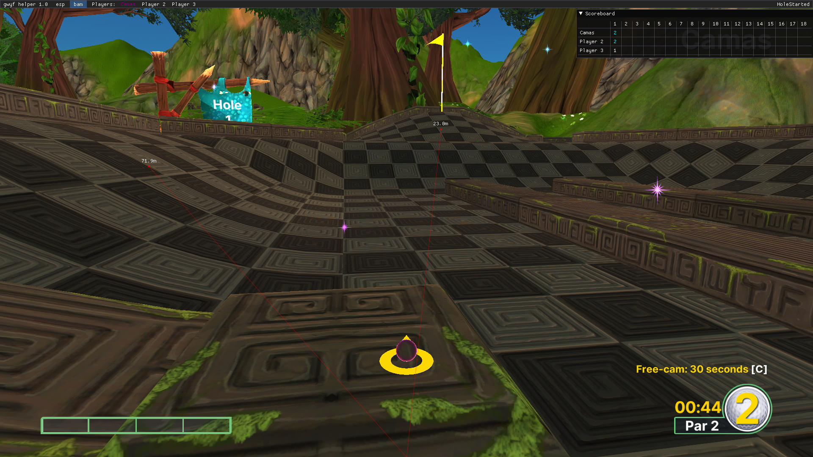

# GWYF Helper

A helper for Golf With Your Friends

Last updated for GWYF version `v751`

`gwyf-helper`: Injects an embedded copy of `injected-dll` into `Golf With Your Friends.exe` using the usual `LoadLibrary` method

`injected-dll`: Main helper logic. Runs inside GWYF for easy access to unity, game data etc.

## `injected-dll` outline

`lib.rs`: Entry point and main helper logic

`renderer/mod.rs`: Finds and hooks the d3d11 render function for imgui

`renderer/imgui_winit_support.rs`: Modified from the original to use a custom window class

`renderer/window.rs`: Modified from the original to only need a HWND instead of whatever it needed before

`api.rs`: il2cpp api functions and structs

`gamestructs.rs`: Rust implementations of GWYF data structures. [Il2cppInspector](https://github.com/djkaty/Il2CppInspector) a big help here

`module.rs`: Wrapper and helper functions for windows module apis

`signature.rs`: (Unused) signature macro. A scanning function is in `module.rs`

## Features

* Automatically copy someone's color

* Scoreboard

* 'bam'

## Notes

* Run after game has started so it has time to load everything

* [Il2CppInspector Tutorial: Working with code in IL2CPP DLL injection projects](https://katyscode.wordpress.com/2021/01/14/il2cppinspector-tutorial-working-with-code-in-il2cpp-dll-injection-projects/)

* Careful using the `offset` function on pointers as it doesn't offset by `n` but `n * size_of::<T>()`

* Will need to manually change offsets after each GWYF update
